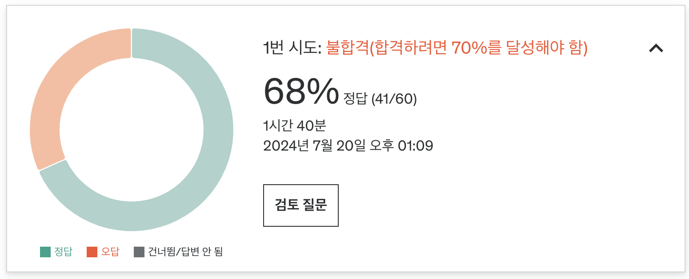

# ✏️ 3주차 오답노트

Practive Test 후 몰랐거나 헷갈린 내용, 새롭게 공부한 내용 등을 정리합니다.

### 결과



### 오답 정리

#### 1. aggregate에 사용되는 연산자들

- `$text`
  - 텍스트 검색을 위해 사용되는 연산자
  - 텍스트 인덱스가 생성된 필드에서 특정 텍스트를 검색할 때 유용하다.
  - 검색어의 형태소 분석을 통해 보다 유연한 검색이 가능하다. (단어의 일부분, 복수형 등).
  ```jsx
  {
    $text: {
      $search: "mongodb", // 검색할 단어, 여러 개 지정 가능
      $language: "english" // 검색 언어
    }
  }
  ```
- `$match`
  - 일반적인 조건을 이용하여 문서를 필터링할 때 사용되는 연산자
  - 주로 집계 파이프라인에서 사용되며, 다양한 조건을 지정할 수 있다.
  - 다양한 데이터 타입을 기준으로 필터링 가능하며, `$eq`, `$gt`, `$lt`, `$in`, `$regex` 등 다양한 비교 연산자와 함께 사용 가능하다.
  ```jsx
  {
    $match: {
      field: {
        $eq: "value";
      }
    }
  }
  ```

#### 2. 컬렉션을 설계하는 방법

> 소셜 미디어 플랫폼을 위한 MongoDB 데이터베이스를 설계하고 있습니다. 이 플랫폼은 사용자를 추적하고, 그들의 친구를 관리하며, 사용자가 작성한 게시물을 기록해야 합니다. 다음 중 어떤 데이터 모델이 이 요구 사항에 가장 적합합니까?

서로 복잡한 관계를 가진 컬렉션들은 서로 다른 컬렉션으로 분리하는게 좋다.  
예제에서는 사용자의 정보, 친구, 게시물을 서로 다른 컬렉션으로 분리하는 옵션이 가장 적절하다.  
이를 통해 개별 엔터티에 대한 효율적인 쿼리, 인덱싱 및 업데이트가 가능하다.  
User 도큐먼트가 친구와 게시물에 대한 참조 배열을 포함하여, 엔티티 간의 명확한 관계를 제공할 수 있다.

#### 3. text index란

- 문자열 컨텐츠 내에서 텍스트 검색을 효율적으로 수행하기 위한 인덱스
  - 해당 필드에 포함된 단어들을 인덱싱하게 된다.
- 복합 필드로도 생성이 가능하다.
  - `db.collection.createIndex({ field1: "text", field2: "text" })`
  - 각 컬렉션에는 하나의 텍스트 인덱스만 생성할 수 있으며, 여러 필드에 대해 텍스트 검색이 필요하다면 해당 필드를 모두 포함하는 하나의 텍스트 인덱스를 만들어야 한다.
- 텍스트 검색 쿼리 수행 시에는 $text 연산자를 이용한다.
  - `db.collection.find({ $text: { $search: "keyword" } })`

#### 4. aggregate를 이용한 최대 값 계산

> “Sales” 부서에서 직원 중 가장 높은 급여를 찾는 SQL 쿼리

find - limit를 이용해서 조회하면 전체 도큐먼트가 조회된다.  
문제에서 원하는 건 최대 급여만을 구하는 것이므로, aggregate를 사용하는 쿼리를 적용해야 한다.  
정답 쿼리에서 $group 단계는 모든 문서를 그룹화하고 (`_id: null`),  `salary` 필드에 대해 `$max` 연산자를 사용하여 최대 급여를 계산한다.

```js
db.employees.find({ department: "Sales" }).sort({ salary: -1 }).limit(1);

db.employees.aggregate([
  { $match: { department: "Sales" } },
  { $group: { _id: null, max_salary: { $max: "$salary" } } },
]);
```

#### 5. view를 생성하는 방법

view 생성 시에는 createView 메서드를 사용하며, 이는 컬렉션 하위가 아닌 전체 db 객체 내에 존재한다.  
매개변수로 뷰를 생성할 대상 컬렉션과, 뷰를 생성하는 파이프라인을 지정한다.

```jsx
db.createView(
  "UsersView", // 뷰의 이름
  "Users", // 소스 컬렉션의 이름
  [
    { $project: { username: 1, email: 1, createdAt: 1 } }, // 파이프라인
  ]
);
```

#### 6. 샤딩 키와 해시 인덱스

> MongoDB 샤드 클러스터에서 개발자는 여러 샤드에 분산된 대규모 고객 데이터 컬렉션을 가지고 있습니다. 개발자는 도큐먼트에 포함된 고객의 state 필드를 기준으로 문서를 효율적으로 쿼리하고자 합니다. 컬렉션은 현재 “state” 필드로 샤딩되어 있지 않습니다. 개발자가 취해야 할 조치는 다음 중 무엇입니까?

“state” 필드로 컬렉션을 샤딩하면 “state” 값에 따라 문서가 샤드에 분산된다.  
이를 통해 특정 state에 대한 쿼리를 실행할 때 MongoDB는 관련된 샤드에만 쿼리를 보낼 수 있어 쿼리 성능이 향상된다.  
“state” 필드를 hash index로 등록하면 동등 쿼리의 성능을 향상시킬 수 있지만, 컬렉션이 ‘state’ 필드를 기준으로 샤딩되지 않는 한 데이터가 샤드에 분산되는 데 도움이 되지 않는다.

- `해시 인덱스` 란?
  - 데이터의 해시 값을 기반으로 생성한 인덱스로, 특정 값에 대한 정확한 매칭에 최적화된 인덱스이다.
    - `db.collection.find({ userId: "someUserId" })`
    - 범위 쿼리나 정렬에는 적합하지 않다.
  - 주로 샤딩 환경에서 데이터 분포를 균등하게 하기 위해 사용하는 인덱스이다.

#### 7. ObjectId를 결정하는 방법

- **타임스탬프 (4바이트)**: 첫 4바이트는 Unix 타임스탬프로, ObjectId가 생성된 시간을 초 단위로 나타낸다.
- **머신 식별자 (3바이트)**: 다음 3바이트는 MongoDB 인스턴스가 실행 중인 머신을 식별한다. 머신의 네트워크 인터페이스 카드(NIC)의 해시 값으로 생성됩니다. 이를 통해 같은 시간에 여러 머신에서 생성된 ObjectId가 충돌하지 않도록 한다.
- **프로세스 ID (2바이트)**: 그 다음 2바이트는 MongoDB 서버 프로세스의 프로세스 ID(PID)를 나타낸다. 이는 같은 머신에서 동시에 여러 MongoDB 프로세스가 실행될 때 ObjectId가 충돌하지 않도록 합니다.
- **카운터 (3바이트)**: 마지막 3바이트는 일종의 카운터로, 동일한 머신 및 프로세스 내에서 같은 초(second) 내에 생성된 여러 ObjectId가 유일성을 유지하도록 한다. 이 카운터는 해당 초에 생성된 ObjectId 수를 나타내며, 각 새 ObjectId가 생성될 때마다 증가한다.

#### 8. insertMany에서 중간에 삽입 실패 시

```json
db.companies.insertMany([
    {"_id": 1, "name": "Facebook"},
    {"_id": 2, "name": "Twitter"},
    {"_id": 2, "name": "Tesla"}
])
```

첫 번째와 두 번째 도큐먼트의 \_id 값을 각각 1과 2로 명시적으로 지정하고 있다.  
세 번째 도큐먼트의 \_id 값이 2로 중복된 값으로 설정되어 있지만, 첫 번째와 두 번째 문서는 여전히 성공적으로 삽입된다

#### 9. 부분 필터 표현

- `partial filter expression`
  - 인덱스의 일부 키만을 필터링하여 인덱싱하는 방법, sparse index를 생성할 때 유용하다.
    - 특정 조건을 만족하는 도큐먼트에 대해서만 인덱스를 생성할 수 있다.
    - 이를 통해 저장 공간을 절약하고 성능을 향상시킬 수 있다.
  - 쿼리에서 해당 인덱스를 사용하기 위해서는, 인덱스 생성 시 사용한 조건과 일치하는 필터 조건을 사용해야 한다.
  ```jsx
  db.collection.createIndex(
    { score: 1 },
    { partialFilterExpression: { score: { $gt: 70 } } }
  );
  ```

#### 10. mongodb에 적용 가능한 패턴

- `Outlier Pattern`: 표준 데이터 모델에 맞지 않는 예외적인 경우나 특이값을 처리하기 위한 패턴

  - 드물게 등장하는 속성 등을 별도의 컬렉션으로 분리해서 저장한다.
  - 이 경우, 한 사용자가 지정된 배열에 저장할 수 없을 만큼 비정상적으로 많은 연락처를 가지고 있다면, 사용자의 연락처는 별도의 컬렉션에 저장하는 식으로 대응할 수 있다.

  ```js
  // 주 컬렉션
  {
    "_id": ObjectId("userId1"),
    "name": "John Doe",
    "email": "john.doe@example.com"
  }
  // 이상치 컬렉션
  {
    "user_id": ObjectId("userId1"),
    "profile_image": "large_image_data",
    "address": {
      "street": "123 Main St",
      "city": "Anytown",
      "zip": "12345"
    }
  }
  ```

- `Schema Versioning Pattern`: 기존 데이터와의 호환성을 유지하면서 데이터 모델 구조를 변경할 때, 각 스키마에 버전을 붙이는 식으로 사용됨

- `Subset Pattern`: 특정 기준에 따라 더 큰 데이터 세트를 더 작은 부분 집합으로 분할

  - 자주 사용되거나 액세스되는 일부 데이터를 별도의 필드나 컬렉션으로 분리하여 저장한다.

  ```js
  // 자주 액세스되는 데이터만을 포함하는 사용자 문서
  {
    _id: ObjectId("..."),
    name: "John Doe",
    email: "john.doe@example.com",
    address: {
      street: "123 Main St",
      city: "Anytown",
      state: "CA",
      zip: "12345"
    },
    preferences: {
      newsletter: true,
      notifications: false
    }
  }

  // 추가 정보를 별도의 컬렉션에 저장
  {
    userId: ObjectId("..."),
    socialSecurityNumber: "123-45-6789",
    driverLicenseNumber: "D1234567"
  }
  ```

- `Attribute Pattern`: 새롭거나 선택적인 데이터를 수용하기 위해 데이터 모델에 추가 속성을 추가
  ```js
  {
    "product_id": 1,
    "name": "Laptop",
    "attributes": [
      { "attribute_name": "brand", "attribute_value": "BrandName" },
      { "attribute_name": "color", "attribute_value": "Black" },
      { "attribute_name": "weight", "attribute_value": "1.5kg" },
      { "attribute_name": "price", "attribute_value": 1000 }
    ]
  }
  ```
- `Extended Reference Pattern`: 엔티티 간의 관계가 단순 참조나 외래 키로 표현하기에 너무 복잡할 때 사용

  ```jsx
  // authors 컬렉션
  {
    "_id": ObjectId("authorId1"),
    "name": "Author Name",
    "nationality": "Nationality"
  }

  // books 컬렉션
  {
    "_id": ObjectId("bookId1"),
    "title": "Book Title",
    "author_id": ObjectId("authorId1"),
    "author_name": "Author Name",      // 확장된 참조
    "author_nationality": "Nationality" // 확장된 참조
  }
  ```
