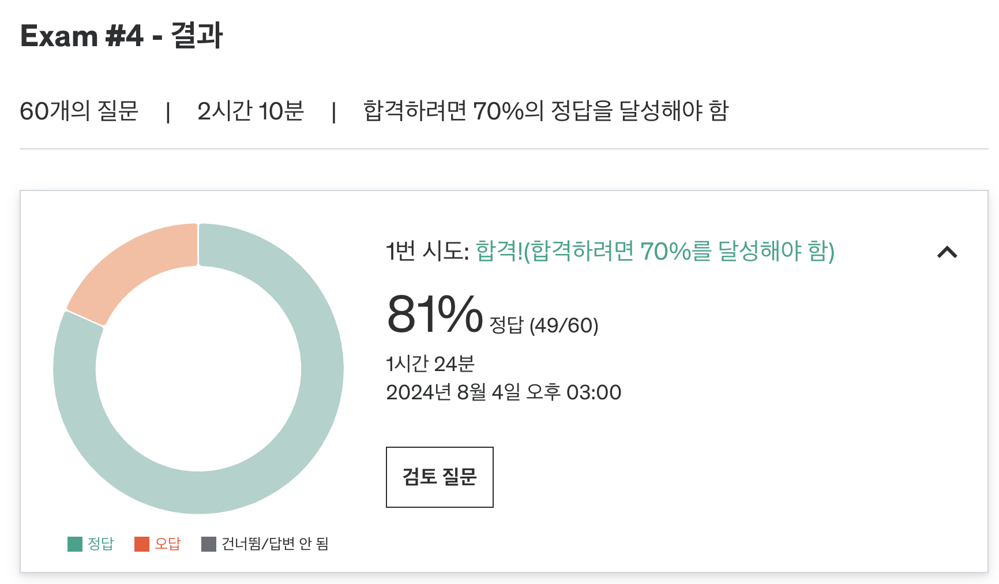

# ✏️ 4주차 오답노트

Practive Test 후 몰랐거나 헷갈린 내용, 새롭게 공부한 내용 등을 정리합니다.

### 결과



### 오답 정리

#### 1. Embedded Relation을 사용하는 목적

MongoDB에서 embedded relation을 사용하는 목적은 여러 관련 엔터티를 단일 문서에 저장해서 조인할 필요를 줄이는 것입니다.  
MongoDB에서 embedded relation은 관련된 엔터티들이 단일 문서에 저장됩니다.  
embedded relation을 사용하는 목적은 모든 관련 데이터를 단일 문서에 저장하여 조인할 필요를 줄이는 것입니다.  
이렇게 하면 단일 데이터베이스 쿼리로 데이터를 검색할 수 있으므로 쿼리 성능이 향상될 수 있습니다.  
그러나 문서의 크기나 관련 엔터티에 대한 업데이트가 복잡해질 수 있다는 한계도 있습니다.  
(embedded relation 기법은 데이터 중복을 반드시 동반하지 않습니다. 데이터를 중복시키는 것은 별도의 선택 사항입니다.)

#### 2. Referenced Relation을 사용하는 목적

referenced relation을 사용하면 관계된 엔터티의 업데이트를 단순화하고 유지보수성을 향상할 수 있습니다.  
이 접근 방식은 컬렉션을 독립적으로 관리하고 업데이트할 수 있게 하여 유지보수성을 향상시킵니다.  
또한, 별도의 컬렉션을 사용하면 관련 엔터티의 업데이트 복잡성을 줄일 수 있습니다.  
각 컬렉션은 고유한 업데이트와 데이터 변경을 가질 수 있기 때문입니다.  
그러나 별도의 컬렉션을 사용하는 것은 쿼리 성능 저하와 조인의 필요성 증가와 같은 단점도 있을 수 있습니다.

#### shard key - targeted query

shard key의 전체, 또는 일부를 가지도록 해야 targeted query가 됩니다.  
이 때 일부의 키를 사용할 때에는 shard key의 앞부분의 부분 집합을 사용해야 합니다.

```ts
// shard key
{ "product_id" : 1, "address" : 1 }

// targeted query
db.flights.find( { product_id: 4326, address: "seoul" } )

db.flights.find( { address: "seoul", product_id: 4326 } )

db.flights.find( { product_id: 4326 } )

// non-targeted query
db.flights.find( { address: "seoul" } )
```

#### 조회 시의 natural order

정렬 순서가 없으면, 문서들은 컬렉션에 삽입된 순서대로 반환됩니다.  
MongoDB에서 db.collection.find() 메서드를 사용할 때 기본 동작은 문서들이 컬렉션에 삽입된 순서대로 반환되는 것입니다.  
이를 “자연 순서(natural order)”라고 합니다.  
(`_id` 기반으로 정렬되는게 아닙니다. 삽입된 순서로 정렬됩니다.)

#### 일대다 관계를 나타내는 방법

MongoDB에서 일대다 관계를 나타내기 위해서는 하나의 엔티티를 문서 배열로 다른 엔티티에 포함시키는 것이 최상의 데이터 모델링 기법으로 간주됩니다.  
이는 관련 데이터를 효율적이고 정확하게 검색할 수 있게 해주며, 데이터 모델링과 저장을 간소화하는 데 도움이 됩니다.  
관련 데이터가 단일 문서에 저장되므로 단일 쿼리로 검색할 수 있으므로, 쿼리 성능을 향상시키고 데이터 모델링과 저장을 간소화할 수 있습니다.  
(몽고 DB에서는 reference를 사용하는 것보다 Embed를 사용하는게 더 나은 모델링 기법으로 간주된다.)

#### 몽고DB에서 covered query가 적용되는 조건

MongoDB에서 covered query가 적용되는 경우는 다음과 같습니다:

- 쿼리에 있는 모든 필드가 인덱스의 일부입니다.
- 쿼리에서 반환되는 모든 필드가 동일한 인덱스에 있습니다.

인덱스의 일부인 필드를 인덱스 키(index keys)라고 하며, 쿼리에서 사용되는 인덱스를 커버링 인덱스(covering index)라고 합니다.

```ts
// 인덱스
{ rates: 1, likes: 1 }

// covered query
db.reviews.find(
    { rates: { $gt: 4.5 } },
    { _id: 0, likes: 1 }
)
// non covered query
db.reviews.find(
    { likes: { $gte: 100 } },
    { _id: 0, rates: 1, likes: 1 }
)
```

covered query 예제에서 쿼리 조건은 인덱스의 일부인 "rates"에 있습니다.  
반환되는 필드는 "votes"이며, 이것도 인덱스에 포함되어 있습니다.  
 "\_id" 필드는 명시적으로 제외되었는데, 이는 중요한 사항입니다.  
왜냐하면 MongoDB는 기본적으로 "\_id" 필드를 포함하며, 만약 "\_id" 필드가 인덱스에 포함되지 않았다면, 쿼리가 커버드 쿼리가 되는 것을 방해할 것이기 때문입니다.

오답의 경우 votes 자체는 인덱스의 부분집합이 될 수 없기 때문에 커버드 쿼리가 될 수 없습니다.

#### 텍스트 검색을 하는 쿼리

MongoDB에서 특정 필드에 대한 텍스트 검색을 수행하기 위해서는 find() 메서드에 $text 연산자, $search 연산자를 사용하여 필드와 검색 쿼리를 지정해야 합니다.  
이러면 해당 필드 내에서 텍스트가 일치되는 도큐먼트를 검색합니다.

```ts
db.collection.find({ text: { $search: "search_content" } });
```

#### 데이터베이스 이름을 짓는 방법

MongoDB의 관례를 따라 데이터베이스 및 컬렉션 이름에 camelCase를 사용해야 한다.  
ordersDatabase 처럼 지으면 된다.  
(underline 스타일은 mongodb에서 권장되지 않는다.)
