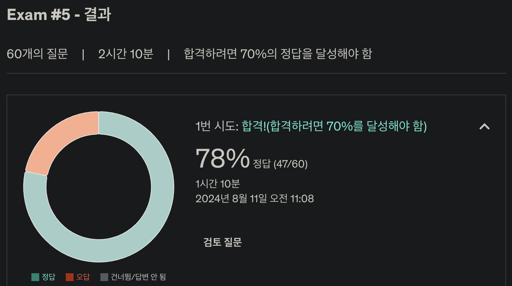

# ✏️ 5주차 오답노트

Practive Test 후 몰랐거나 헷갈린 내용, 새롭게 공부한 내용 등을 정리합니다.

### 결과

### 오답 정리

#### 1. Read Concern 옵션

Read Concern 옵션은 읽기 작업에서 데이터 일관성 및 지속성을 제어하는 방법을 제공합니다. 각 옵션은 읽기 작업이 실행될 때 데이터의 최신성 및 안정성 수준을 결정합니다.

- **local**: 읽기 작업이 로컬에서 사용 가능한 가장 최근의 데이터를 반환하므로, 데이터를 primary 또는 secondary에서 읽을 수 있게 합니다. 세션 일관성을 제공하지 않으며 롤백될 수 있는 데이터를 반환할 수 있습니다.
- **available**: local과 비슷하지만 secondary member 로부터도 읽기를 수행하는 설정입니다. 반환된 데이터가 replica set 구성원의 과반수에 의해 확인되었음을 보장하지 않으며, 커밋되지 않았거나 나중에 롤백될 수 있는 데이터를 반환할 수 있습니다.
- **majority**: 반환된 데이터가 replica set 구성원의 과반수에 의해 확인되었음을 보장합니다. 이는 정상적인 상황에서 데이터가 롤백되지 않도록 보장하지만, 세션 일관성을 제공하지 않습니다.
- **linearizable:** 가장 높은 일관성 수준을 제공하는 옵션으로, primary 노드로부터 해당 시점까지 커밋된 가장 최신 데이터를 반환합니다. 가장 최신의 데이터에 대한 일관성을 보장할 수 있으나 성능이 가장 느립니다.
- **snapshot**: 세션에서 일관된 스냅샷을 제공하는 옵션으로, 동일한 세션 내에서 발생하는 모든 읽기 작업은 동일한 시점의 데이터를 반환합니다. 이는 세션 내에서 강력한 일관성을 보장합니다.

#### 2. MongoDB Session

MongoDB의 세션은 클라이언트가 여러 연속된 데이터베이스 작업을 수행할 때 일관된 컨텍스트를 유지할 수 있도록 하는 기능입니다.

이 세션은 트랜잭션과 함께 사용될 수 있으며, 동일한 세션 내에서 수행되는 모든 작업은 일관된 시점의 데이터를 참조하게 됩니다.

#### 3. 쿼리를 실행할 때 기본 정렬 기준

MongoDB는 각 컬렉션의 문서마다 고유 식별자로 \_id 필드를 사용합니다.  
기본적으로 \_id 필드는 인덱싱되며 오름차순으로 정렬됩니다.  
쿼리를 실행할 때 별도의 정렬 순서를 지정하지 않으면 MongoDB는 \_id 필드를 기준으로 오름차순으로 일치하는 문서를 반환합니다.

이 때 예외 사항이, db.find() 를 할 때에는 natural order(삽입된 순서)를 사용한다.

#### 4. 다대다 관계 설정 시 관계를 위한 별도의 컬렉션 생성

두 엔터티 간의 관계를 위한 별도의 컬렉션을 생성하는 것은 올바른 방법입니다.  
이는 MongoDB에서 다대다 관계를 표현하기 위한 가장 좋은 데이터 모델링 기법으로 간주됩니다.

이 방법은 두 엔터티 간의 관계 무결성(integrity of the relationship)을 유지하면서 유연하고 확장 가능한 데이터 모델링(flexible and scalable data modeling)을 가능하게 합니다.  
두 엔터티 간의 관계를 위한 별도의 컬렉션이 생성되면, 각 관계를 별도의 문서로 저장할 수 있으며, 필요할 때 효율적이고 정확하게 검색할 수 있습니다.

#### 5. 이중 위계 관계 모델링

예를 들어 Users - Books - Reviews 세 개의 컬렉션의 위계 관계를 모델링 한다고 합시다.  
Users, Books는 서로 참조하는 별도의 컬렉션에 저장하고, Reviews는 Books 도큐먼트 내에 포함시키는 것이 올바른 방법입니다.  
이 모델은 조인의 필요성을 최소화하여 효율적으로 작업이 가능하도록 지원합니다.  
Reviews가 Books에 포함되어 있으므로, 책에 대한 모든 리뷰를 단일 쿼리로 가져올 수 있습니다.  
Users와 Books은 별도의 컬렉션으로 관리되며 참조로 연결되어 있어, 사용자의 프로필을 효율적으로 조회할 수 있으며, 사용자가 작성한 모든 리뷰를 찾는 것도 효율적으로 수행할 수 있습니다.

User, Book, Reviews를 모두 별개의 컬렉션으로 관리할 경우 불필요하게 조인이 많이 발생할 수 있습니다.

#### 6. mongodump vs mongoexport

mongodump 명령어는 MongoDB 데이터베이스에서 데이터를 이진 덤프 형태로 생성하는 데 사용됩니다.  
이 명령어는 MongoDB에서 사용되는 BSON 형식으로 데이터를 내보낼 수 있습니다.

mongoexport 명령어는 MongoDB 컬렉션에서 데이터를 JSON, CSV, 또는 TSV 형식으로 내보내는 데 사용됩니다.  
BSON 형식으로 데이터를 내보내지는 않습니다.

#### 7. 일대다 관계 모델링 시 Reference의 배열 필드 사용

MongoDB에서 Referenced Relationship을 사용하여 일대다 관계를 모델링할 때, 관련 엔터티를 별도의 컬렉션에 저장하는 것이 권장됩니다.  
이 접근 방식은 컬렉션을 독립적으로 관리하고 업데이트할 수 있게 함으로써 유지보수성을 향상시킬 수 있습니다.  
또한, 별도의 컬렉션을 사용하면 데이터가 필요에 따라 여러 컬렉션과 데이터베이스에 분산될 수 있도록 하여 애플리케이션의 확장성을 향상시킬 수 있습니다.

부모 문서에서 관련 엔터티를 참조하기 위해, ObjectId 배열을 사용하는 것이 권장됩니다.  
이를 통해 부모 문서가 단일 필드에서 여러 관련 엔터티를 참조하면서도 부모 문서와 관련 엔터티 간의 관계를 유지할 수 있습니다.

#### 8. $elemMatch vs $in

$elemMatch 는 배열 필드에서 지정된 모든 조건과 일치하는 요소를 포함하는 문서를 매칭하는 데 사용됩니다.  
$in 은 필드의 값이 지정된 배열 내의 값 중 하나와 일치하는 문서를 매칭하는 데 사용됩니다.

#### 9. 삭제를 시도하는 도큐먼트가 다른 도큐먼트에 의해 참조되고 있으면 에러 발생

삭제된 문서에 대한 참조가 다른 컬렉션에 존재할 경우 오류가 발생합니다.  
샤딩된 MongoDB 컬렉션에서 db.collection.deleteMany() 메서드를 사용하여 문서를 삭제할 때, 다른 컬렉션에 삭제된 문서에 대한 참조가 있으면 참조 오류가 발생할 수 있습니다.

MongoDB는 삭제된 문서에 대한 참조를 자동으로 업데이트하거나 제거하는 메커니즘을 제공하지 않으므로, 삭제된 문서에 대한 참조는 무효화됩니다.  
이 경우, deleteMany() 메서드는 다른 컬렉션에 삭제된 문서에 대한 참조가 여전히 존재한다는 오류를 발생시킵니다.

이러한 참조 오류를 피하기 위해, 삭제 작업을 실행하기 전에 삭제된 문서에 대한 참조가 업데이트되거나 제거되었는지 확인하는 것이 중요합니다.  
또한, 서로 다른 샤드 간에 문서 간의 참조가 있는 경우, 삭제 작업 중에 참조가 올바르게 유지되도록 주의해야 합니다.

#### 10. Schema Versioning Pattern을 사용하는 사례

시스템을 종료하지 않고 현재 스키마에 추가 필드를 업데이트하는 작업, 모든 문서를 빠르게 업데이트해야 하는 상황에서는 Schema Versioning Pattern을 활용하면 좋습니다.  
업그레이드 과정에서 다운타임을 최소화하는 데 도움이 되며, 문서가 새로운 스키마로 업데이트되는 동안에도 시스템이 올바르게 작동하도록 보장할 수 있습니다.  
또한 문서의 여러 버전을 유지해야 할 때도 효과적입니다.

#### 11. 삭제 작업의 Replica Set 내에서의 전파

MongoDB Replica Set에서 db.collection.deleteOne() 메서드는 Replica Set의 모든 노드에서 문서를 제거하지만, db.collection.deleteMany() 메서드는 문서를 primary 노드에서만 제거합니다.  
이는 Replica Set에서 primary 노드에 대한 쓰기는 자동으로 모든 보조 노드에 복제되지만, 삭제는 그렇지 않기 때문입니다.

deleteOne() 메서드를 사용할 때, 지정된 도큐먼트는 primary 노드에서 제거되며, 결과적으로 복제를 통해 모든 보조 노드에서도 제거됩니다.  
deleteMany() 메서드를 사용할 때, 문서는 primary 노드에서만 삭제되며, 다음 복제 주기까지 보조 노드에서는 이러한 변경 사항이 반영되지 않습니다.

#### ReplicaSet의 쓰기 전파

클라이언트가 Primary 노드에 쓰기 작업(예: 데이터 삽입, 업데이트, 삭제)을 요청하면, Primary 노드는 이 작업을 데이터베이스에 적용합니다.  
Primary 노드는 이 쓰기 작업을 수행한 후, Oplog(operations log)에 작업 내용을 기록합니다.  
Oplog는 Primary 노드와 Secondary 노드 간의 데이터를 동기화하기 위한 로그로, 각 쓰기 작업의 순서와 내용이 기록됩니다.

Secondary 노드들은 주기적으로 Primary 노드의 Oplog를 폴링(polling)하여, 새로운 쓰기 작업이 기록되었는지 확인합니다.  
각 Secondary 노드는 Primary의 Oplog에서 새로운 쓰기 작업을 가져와 자신의 데이터베이스에 이를 재연(적용)하는데, 이 과정을 "복제(replication)"라고 합니다.

쓰기 작업이 Secondary 노드들로 전파되는 데는 약간의 시간이 걸리기 때문에, 읽기 작업이 Primary와 Secondary 노드에서 다른 결과를 반환할 수 있는 상황이 발생할 수 있습니다.  
이를 "일관성 지연(consistency lag)"이라고 하며, MongoDB에서는 읽기 일관성 수준을 조정할 수 있는 옵션이 있어 읽기 작업이 모든 노드에 쓰기가 전파된 후에만 수행되도록 강제할 수도 있습니다.

클라이언트는 쓰기 작업이 Primary 노드에 적용된 후에 확인 응답을 받을 수 있습니다.  
추가적으로, 클라이언트는 write concern 설정을 통해 쓰기 작업이 특정 수의 Secondary 노드에 성공적으로 전파될 때까지 대기한 후 응답을 받도록 설정할 수 있습니다.
