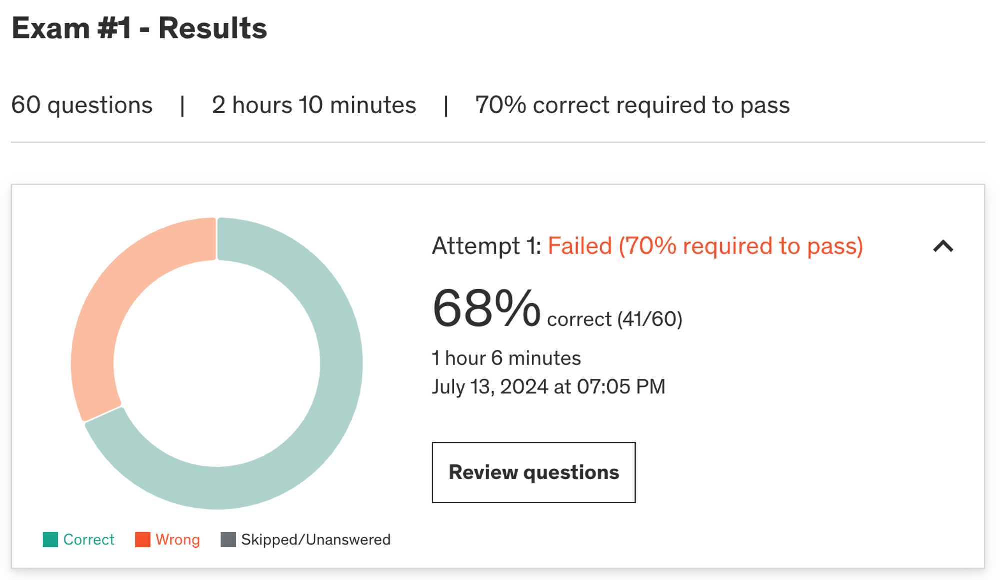

### ✏️ 2주차 오답노트
Practive Test 후 몰랐거나 헷갈린 내용, 새롭게 공부한 내용 등을 정리합니다.
#### 결과

#### 오답 정리
1. **주어진 상황에 맞는 쿼리 작성**
> 주어진 컬렉션에서 특정 부서에서 salary가 n이 넘는 사람들의 평균 salary를 그룹화   

```
db.employees.aggregate([
    { $match: { department: "Sales" } },
    { $group: { _id: "$department", avg_salary: { $avg: "$salary" } } },
    { $match: { avg_salary: { $gte: 60000 } } }
]);
```

이 쿼리는 첫번째 스테이지에서 `department` 기준으로 필터링 시키고 `department` 기준으로 `salary` 평균을 내 group화 한 후 다시 평균 `salary가` 60000 이상인 문서들만 필터링한다.

하지만 이렇게 하면 같이 필터링 할 수 있는 정보를 중복해서 수행함으로 쿼리 성능이 떨어진다.

이 쿼리를 아래처럼 바꾸면 더 효율적이게 된다.
```
db.employees.aggregate([
    { $match: { department: "Sales", salary: { $gte: 60000 } } },
    { $group: { _id: "$department", avg_salary: { $avg: "$salary" } } }
]);
```
첫번재 match 스테이지에서 바로 salary 필터링까지 진행한 후 부서별 평균값을 구함으로 가장 효율적인 쿼리이다.

2. **MongoDB가 데이터 저장시 JSON 대신 BSON을 사용하는 이유**
[MongoDB JSON and BSON 참고](https://www.mongodb.com/resources/basics/json-and-bson)

- **MongoDB가 JSON을 선택할 수 없었던 이유**
    - JSON은 제한된 수의 기본 데이터 타입만 지원함
        - 특히나 날짜, 이진 타입에 대한 지원이 부족했음
    - JSON objects와 properties 에는 고정된 길이가 없어 순회 속도가 느렸음

⇒ 그래서 JSON 형식을 가져가지만 공간/속도/효율성에 최적화된 Binary JSON 사용

- `JSON (JavaScript Object Notation)`
    - human-readable 데이터 교환 형식
    - JS 언어 표준의 subset이지만 완전히 language 독립적
- `BSON (Binary JSON)`
    - 이진 구조로 유형 및 길이 정보를 인코딩
    - 날짜와 이진 데이터 같은 기존 JSON에서 지원하지 않던 데이터 타입을 지원
    - JSON 오브젝트를 Binary 데이터로 저장하는 방식 (아래 참고)
    
    ```tsx
    {"hello": "world"} →
    \x16\x00\x00\x00           // total document size
    \x02                       // 0x02 = type String
    hello\x00                  // field name
    \x06\x00\x00\x00world\x00  // field value
    \x00                       // 0x00 = type EOO ('end of object')
    ```
    
    - MongoDB Driver는 쿼리 시 데이터를 BSON 으로 변환하는 작업을 수행함
- **BSON in MongoDB 특징**
    - BSON 문서는 **순수 JSON 문서에서 표현할 수 없는 Date나 Binary 개체가 포함**될 수 있다.
    - 각 프로그래밍 언어에는 **고유의 Object semantics가 존재**한다.
        - 예를 들어 JSON 객체에는 순서가 지정된 키가 있지만, Python 딕셔너리에는 순서가 없고 숫자와 문자열 데이터 타입에 차이도 발생할 수 있음
    - BSON은 **JSON이 지원하지 않는 다양한 숫자 타입을 지원**하며 많은 언어들이 이를 다르게 표현한다.

|  | JSON | BSON |
| --- | --- | --- |
| Encoding | UTF-8 String | Binary |
| Data Support | String, Boolean, Number, Array, Object, null | String, Boolean, Number (Integer, Float, Long, Decimal128...), Array, null, Date, BinData |
| Readability | Human and Machine | Machine Only |

3. **MongoDB Driver**
> MongoDB drivers provide an abstraction layer that allows developers to work with MongoDB without considering the underlying database structure.

이 설명은 MongoDB Driver에 대한 옳은 설명일까?
정답은 아니다.
- MongoDB Driver는 개발자가 편하게 작업할 수 있는 interface를 제공하지만, 기본 데이터베이스 구조 자체를 추상화하지는 않는다.
- 개발자는 여전히 쿼리와 데이터베이스 모델에 대한 기본 지식이 있어야한다.

4. **`explain()` 메서드**
[MongoDB explain() 가이드 참고](https://www.mongodb.com/ko-kr/docs/manual/reference/method/cursor.explain/)

    - [`db.collection.find()`](https://www.mongodb.com/ko-kr/docs/manual/reference/method/db.collection.find/#mongodb-method-db.collection.find) 메서드에 대한 쿼리 계획에 대한 정보를 반환
    - 쿼리 계획이 포함된 문서와 실행 통계(선택 사항)를 반환
    - 허용되는 매개변수
        - `verbose` (문자열) - 출력의 상세도를 설정한다. 가능한 모드는 아래와 같다.
            - `queryPlanner` (기본 모드)
            - `executionStats`
            - `allPlansExecution`
    - `explain()` 사용시 기존의 모든 계획 캐시 항목이 무산되고 MongoDB 쿼리 플래너가 새 계획 캐시 항목을 만들 수 없음
    - 쿼리 실행 중 사용되는 인덱스를 알 수 있음
    - 쿼리 정렬 단계가 index를 사용해 수행했는지 메모리에서 수행했는지에 대한 세부 정보를 알 수 있음

5. **MongoDB document와 collection간 관계**
- 헷갈렸던 부분
  - document에는 여러 collection이 포함될 수 있다.
    - 이 부분 해석을 잘 했어야하는데 collection 안에 document가 있는 개념이고 record일 뿐 document 안에 collection이 포함될 수 없다.
    - 여러 collection 안에 같은 document가 있을 수 있다의 개념으로 이해해서 틀렸다.

  - collection은 MongoDB의 문서 그룹이며, RDBMS의 table과 같은 개념이다.
    - collection안에 document에는 여러 필드가 있고 일반적으로 한 collection 안에는 같은 목적의 문서들이 모여있음 → table과 유사 개념이다.

6. **데이터베이스 명령어 실행 메서드**
[db.runCommand() 가이드 참고](https://www.mongodb.com/docs/manual/reference/method/db.runCommand/)

- **db.runCommand(command, [options])**
    - 특정한 데이터베이스 명령어를 실행하도록 도와줌
    - shell과 driver 사이에 일관된 인터페이스를 제공
    - option은 MongoDB 2.0 부터 지원
    - `options.readPreference`
        - 지정하지 않으면 기본 값은 primary
        - MongoDB 2.0부터 `db.runCommand()`는 `Mongo.setReadPref()`나 연결 문자열 같은 전역적인 readPreference 설정을 무시한다. (1.0은 아님)
    - 일부 명령은 admin 데이터베이스에서만 사용 가능하므로 미리 db 객체를 바꾸거나 `db.adminCommand()`를 사용해야한다.
    
    ```tsx
    db.runCommand( { hello: 1 } )
    // readPreference 
    db.runCommand( { hello: 1 }, { readPreference: "secondaryPreferred" } )
    ```

7. **MongoDB 데이터 모델에 영향을 미치는 제약조건**
- Network, RAM, **Security & Compliance** 
- Security & Compliance 
  - 개인 정보 보호 규정 같이 데이터 보호를 위한 규정 준수 사항은 데이터 모델에 제약을 부여함
  - 민감한 데이터가 저장/액세스 되는 방법을 지시할 수 있다.

8. **유효성 검사를 우회하고 삽입 중 발생하는 오류를 건너뛰는 방법**
```
db.orders.insertMany(
  [
    { item: "Keyboard", quantity: 10, price: 20.99 },
    { item: "Mouse", quantity: 5, price: 14.99 }
  ],
  { validate: false, continueOnError: true }
)
```

9. **One to One 관계**
- field embedding
- reference to another collection
- child document 

뭐가 더 효율적인지는 다르겠지만 거의 모든 방법으로 one-to-one relationship을 표현할 수 있다.

10. **index 키 생성 개수**
```
{ a: 1, b: 1 } // example index

// document
{
    a: "test",
    b: ["hi", "hello", "world"],
    c: 2020
}
```
주어진 구조에서 몇개의 인덱스 항목이 생성될까?
a와 b필드에 인덱스가 걸려있으므로 a필드-b필드 배열 항목 각각으로 아래처럼 3개의 항목이 생성된다.
```
"test", "hi"
"test", "hello"
"test", "world" 
```

11. **bulk write operation**
[MongoDB bulkWrite 가이드 참고](https://www.mongodb.com/docs/manual/reference/method/db.collection.bulkWrite/)

- 대량 문서 write 연산 시 주로 사용

```tsx
db.collection.bulkWrite(
    [ <operation 1>, <operation 2>, ... ],
    {
      writeConcern : <document>,
      ordered : <boolean>
    }
)
```
|  | Type | Description |
| ---- | ----- | -------------------- |
| `operations` | array | An array of `bulkWrite()` write operations. Valid operations are: `insertOne`, `updateOne`, `updateMany`, `deleteOne`, `deleteMany`, `replaceOne`  |
| `writeConcern` | document | Optional. A document expressing the write concern. Omit to use the default write concern. Do not explicitly set the write concern for the operation if run in a transaction.|
| `ordered` | boolean | Optional. A boolean specifying whether the mongod instance should perform an ordered or unordered operation execution. Defaults to true. |


- bulkWrite는 write 작업을 각각 가져와 실행한다.
- ordered 옵션이 true이면 작업 순서를 순서대로 지정할 수 있다.
    - false이면 MongDB가 성능 최적화를 위해 순서를 바꿀 수 있음
- 시계열 컬렉션에서는 `insertOne`만 사용 가능하다.
- `insertOne` - 단일 문서 삽입
    
    ```tsx
    db.collection.bulkWrite( [
       { insertOne : { "document" : <document> } }
    ] )
    ```
    
- `updateOne` - filter와 일치하는 컬렉션의 단일 문서 업데이트
    - 여러 문서가 일치할 경우 첫번째 문서만 업데이트
    
    ```tsx
    db.collection.bulkWrite( [
       { updateOne :
          {
             "filter": <document>,
             "update": <document or pipeline>,
             "upsert": <boolean>,
             "collation": <document>,
             "arrayFilters": [ <filterdocument1>, ... ],
             "hint": <document|string>
          }
       }
    ] )
    ```
    
- `updateMany` - filter와 일치하는 컬렉션의 모든 문서 업데이트
    
    ```tsx
    db.collection.bulkWrite( [
       { updateMany :
          {
             "filter" : <document>,
             "update" : <document or pipeline>,
             "upsert" : <boolean>,
             "collation": <document>,
             "arrayFilters": [ <filterdocument1>, ... ],
             "hint": <document|string>
          }
       }
    ] )
    ```
    
- `replaceOne` - filter와 일치하는 컬렉션의 단일 문서 대체
    - 여러 문서 일치 시 첫번째 문서만 대체
    
    ```tsx
    db.collection.bulkWrite([
       { replaceOne :
          {
             "filter" : <document>,
             "replacement" : <document>,
             "upsert" : <boolean>,
             "collation": <document>,
             "hint": <document|string>
          }
       }
    ] )
    ```
    
- `deleteOne/Many` - filter와 일치하는 컬렉션의 단일문서/모든문서 삭제

12. **query index의 규칙**
[Performance Best Practice: Indexing](https://www.mongodb.com/blog/post/performance-best-practices-indexing)

- MongoDB Index
    - index가 없으면 데이터베이스는 일치하는 문서를 찾기 위해 컬렉션의 모든 문서를 스캔해야함
    - index를 통해 검색할 문서의 수를 줄일 수 있다.
- Compound Index
    - 복합 인덱스로 여러 필드로 구성된 인덱스
- **Follow the ESR rule**
    - index의 필드 순서를 정하기 위한 일 규칙
    1. **equality (동등성)** 
        1. 동등 쿼리가 실행되는 필드 추가
    2. **sort (정렬)**
        1. 쿼리의 정렬 순서를 반영
    3. **range (범위)**
        1. 액세스할 데이터의 범위
- covered queries 는 문서에 직접 접근하지 않고 인덱스에서 결과를 반환함으로 매우 효율적

13. **collection 삭제 명령어**
[db.collection.drop() 가이드 참고](https://www.mongodb.com/docs/manual/reference/method/db.collection.drop/)
- dropCollection() 이란 명령어는 MongoDB에 없다.
- `drop()` 명령어를 통해 컬렉션을 삭제할 수 있다.
- 삭제된 컬렉션과 관계된 모든 index도 제거한다.

```tsx
db.collection.drop( { writeConcern: <document> } )
```

14. **index를 사용하는 쿼리**
`title` 이란 필드에 index가 생성되어 있을 때 아래 쿼리는 인덱스를 탈까?
```
db.movies.find()
```
언뜻 생각해보면, 모든 문서를 조회하니 title 필드도 있을테고 인덱스를 타지 않을까? 라 생각할 수 있지만,
특정 필터링 없이 모든 문서를 검색하므로 title 필드에 대한 index를 사용하지 않는다.
구체적인 기준이 있어야 인덱스를 탈 수 있다.

15. **aggregation 기본 문법 형식**
```
db.myCollection.aggregate([
    { stage1 }, 
    { stage2 },
    ..., 
    { stageN }
], { options } ) 
```
[MongoDB Aggregation 가이드 참고](https://www.mongodb.com/docs/manual/aggregation/)

- **aggregation**
    - 여러 문서를 주어진 연산자에 맞게 처리하고 결과를 반환
    - 여러 문서로부터 값을 그룹화하거나 그룹화된 값으로부터 작업을 수행해 단일 결과를 반환
    - 시간에 따른 데이터 변화를 분석
- **aggregation pipeline**
    - 문서를 처리하는 하나 이상의 단계로 구성된 파이프라인
    - $merge, $out 과 같은 단계가 포함되지 않는한 문서를 직접적으로 수정하진 않는다.
    - `db.collection.aggregate(pipeline, options)`
        - pipeline 내에 options가 포함된 구조가 아니라 별개이다.