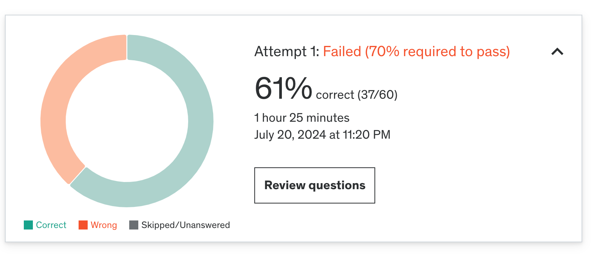

### ✏️ 3주차 오답노트
Practice Test 후 몰랐거나 헷갈린 내용, 새롭게 공부한 내용 등을 정리합니다.

#### 결과

#### 오답 정리
1. **주어진 쿼리에 효율적인 인덱스**
```
db.hotels.aggregate([
  { "$match": { "stars": { "$gt": 4.5 } } },
  { "$sort": { "stars": 1 } }
])
```
주어진 쿼리에서는 `stars` 필드를 기준으로 필터링하는 $match와  `starts` 필드를 기준으로 sort하는 두가지 단계가 있다.
일단 `starts` 필드를 기준으로 오름차순 인덱스를 삽입해야 효율적이다.
```
db.hotels.createIndex( { "stars": 1 } )
```
여기서 헷갈렸던 건 아래처럼 2가지 경우 모두 생성하는 인덱스였는데
```
db.hotels.createIndex( { "stars": 1, "stars": -1 } )
```
MongoDB Compound Index에서는 중복 키를 가질 수 없다.
따라서 중복 키에 복합 인덱스로 오름차순/내림차순 모두 생성할 수 없다.

2. **누락된 값이 포함된 필드에 대한 정렬**
> MongoDB가 누락된 값이 포함된 필드에 대한 정렬을 다루는 방법

-> MongoDB에서 누락된 값은 null로 간주된다.
-> 오름차순에서는 누락된 값이 먼저 정렬된다.
-> 내림차순에는 누락된 값이 마지막에 온다.

> 다양한 유형의 BSON 타입을 같이 정렬할 때 비교 순서 - [참고 문서](https://www.mongodb.com/docs/manual/reference/operator/aggregation/sort/)

  1. MinKey (internal type)
  2. Null
  3. Numbers (ints, longs, doubles, decimals)
  4. Symbol, String
  5. Object
  6. Array
  7. BinData
  8. ObjectId
  9. Boolean
  10. Date
  11. Timestamp
  12. Regular Expression
  13. MaxKey (internal type)

null 값이 먼저 정렬된다는 건 알고 있었는데 MongoDB 버전에 따라 다르다는 선택지를 보고 혹시..? 라는 마음에 함정에 걸렸다 

3. **객체 배열 내부 필드 업데이트**
아래 document 구조에서 특정 조건에 맞는 document의 `Math` 수업 성적을 95로 업데이트 하는 방법
```
{
   "_id" : ObjectId("5f0a7e80d8c9c7b5a48c49e1"),
   "name" : "Alice",
   "age" : 21,
   "courses" : [
      {
         "name" : "Math",
         "grade" : 89
      },
      {
         "name" : "Science",
         "grade" : 92
      }
   ]
}
```

`grade` 필드는 `courses` 배열 내 객체 안에 있는 필드이다.
이런 구조를 업데이트 하기 위해선 `$` 를 사용한다.
`courses.$.grade` 그냥 객체였다면 . dot 만 붙여도 되지만 배열이기 때문에 `$` 를 중간에 넣어줘야한다.
```
db.students.updateOne(
   { _id: ObjectId("5f0a7e80d8c9c7b5a48c49e1"), "courses.name": "Math" },
   { $set: { "courses.$.grade": 95 } }
)
```

이것도 당연히 알고 있었는데 생각 없이 풀다가 틀렸다.

4. **리뷰 데이터 모델링**
> e-commerce 서비스에서 products 정보가 있고 각 product 마다 reviews 가 여러개 존재할 때 올바른 데이터 모델링 접근 방식
reviews 내에는 사용자 이름, 리뷰 내용, 날짜, 평점 등이 있음

처음에 리뷰를 array로 products에 임베딩하는 방식을 생각했는데
리뷰가 많아질수록 비효율적인 구조라 생각해 리뷰 컬렉션 분리 후 키를 가지고 가는 방식으로 골랐으나

정답은 products 내에 임베딩 하되, 100개 정도로 문서 수를 제한하는 것이었다.

근데.. product에 대한 리뷰 수를 몇개로 제한하는 경우가 있나?라 생각해서 고르지 않았는데 .. 
뭔가 애매한 문제다.
100개가 넘게 리뷰가 쌓이면 그때는 어쩔 수 없이 컬렉션 분리해야하는 거 아닌가?

5. **array of document**
아래와 같은 구조의 `students` 컬렉션에서 age가 18보다 큰 학생들의 성적 평균을 구하는 쿼리
```
{
  "_id": "<student id>",
  "name": "<student name>",
  "age": <student age>,
  "grades": [<array of grade documents>]
}
```
이 문제의 중요한 포인트는 `grades` 필드가 array of document 인 점

나는 아래 쿼리를 골랐는데 
```
db.students.aggregate([
  { "$match": { "age": { "$gt": 18 } } },
  { "$group": { "_id": null, "avgGrade": { "$avg": "$grades" } } }
])
```
`grades`는 document 배열이기 때문에 정답은 아래처럼 `grades` 문서 배열을 각 문서별로 `unwind` 후 `$grades.score`의 평균을 구하는 쿼리이다.
```
db.students.aggregate([
  { "$match": { "age": { "$gt": 18 } } },
  { "$unwind": "$grades" },
  { "$group": { "_id": null, "avgGrade": { "$avg": "$grades.score" } } }
])
```

6. **Attribute Pattern**
> Attribute Pattern (속성 패턴)을 적용하는 가장 적합한 시나리오 찾기

이 패턴은 처음 들어봐서 새로 찾아서 공부해보았다.

[MongoDB Attribute Pattern Article](https://www.mongodb.com/developer/products/mongodb/attribute-pattern/)

- Attribute Pattern이 적합한 경우
  - 유사한 필드가 많이 포함된 큰 문서가 있지만, 공통 특성을 공유하는 필드 subset이 있고, 해당 필드의 subset을 정렬하거나 쿼리하고 싶을 때
  - 정렬해야하는 필드가 문서의 subset에만 있을 때
  - 위 두가지 조건이 문서에서 모두 충족될 때

성능을 위해서 subset 문서 쿼리에 인덱스를 삽입하려면 너무 많은 인덱스가 필요할 수 있음
오히려 이런 인덱스를 많이 생성할 수록 성능을 저하시킬 수 있다.

- **Attribute Pattern 예시**
```
{
    title: "Star Wars",
    director: "George Lucas",
    ...
    release_US: ISODate("1977-05-20T01:00:00+01:00"),
    release_France: ISODate("1977-10-19T01:00:00+01:00"),
    release_Italy: ISODate("1977-10-20T01:00:00+01:00"),
    release_UK: ISODate("1977-12-27T01:00:00+01:00"),
    ...
}
```
Movies 컬렉션을 생각해보자
여기에는 영화와 관련된 유사한 필드들이 많다.
이때 영화 출시일을 검색하고 싶다고 가정해보자. 문제는 영화 출시일이 각 지역마다 다르다는 점이다.

이런 상황에서 개봉 날짜를 검색하려면 각 지역 출시일 필드에 모두 index를 생성해줘야한다.
```
{release_US: 1}
{release_France: 1}
{release_Italy: 1}
...
```

여기서 Attribute Pattern을 적용하면 지역별 출시일 정보를 subset으로 이동해서 아래처럼 문서를 바꿀 수 있다.
```
{
    title: "Star Wars",
    director: "George Lucas",
    ...
    releases: [
        {
        location: "USA",
        date: ISODate("1977-05-20T01:00:00+01:00")
        },
        {
        location: "France",
        date: ISODate("1977-10-19T01:00:00+01:00")
        },
        {
        location: "Italy",
        date: ISODate("1977-10-20T01:00:00+01:00")
        },
        {
        location: "UK",
        date: ISODate("1977-12-27T01:00:00+01:00")
        },
        ...
    ],
    ...
}
```
이렇게 배열 subset으로 이동시키면 검색 성능을 높이기 위한 index를 아래처럼 배열의 각 요소에만 만들면 된다.
```
{ "releases.location": 1, "releases.date": 1}
```

7. **대규모 e-commerce 앱에서 MongoDB Driver와 Indexing의 역할**
- 내가 고른 답
> MongoDB drivers enable the execution of complex search queries by providing query optimization and indexing mechanisms.

- 틀린 이유 
  - MongoDB Driver가 데이터베이스와 상호작용하는 동안 쿼리 최적화 및 인덱싱 매커니즘은 Driver가 아닌 MongoDB 자체적으로 수행하는 일이다.

- 실제 정답
> MongoDB drivers handle the creation and management of indexes, improving query performance.

  - MongoDB Driver는 인덱스를 생성/수정/삭제할 수 있는 API를 제공해 인덱스의 생성/관리를 할 수 있도록 도와준다.

8. **MongoDB's replication 설명 중 틀린 설명**
- 내가 고른 답
> A replica set can consist of only two servers: one primary and one 
secondary.

기본 replica set에는 primary와 secondary가 기본 구성이다.
secondary 노드를 딱 1대만 둘 수 있다란 말로 이해해서 틀렸다.

- 정답
> Every replica set can have multiple primary servers.

각 replica set에는 primary node가 여러개가 아닌 1개만 존재할 수 있다. secandary node는 primary의 oplog를 복제하고 해당 데이터 셋에 적용하는 역할을 한다.

9. **쿼리가 특정 index를 타게 해주는 method**

- [cursor.hint()](https://www.mongodb.com/docs/manual/reference/method/cursor.hint/)
  - MongoDB의 기본 인덱스 선택 및 쿼리 죄적화 프로세스를 재정의하는 메서드
  - 아래처럼 만들어진 index 이름을 지정해주거나 바로 넣을 수 있다. 
  - `{ $natural : 1 }` 를 사용하면 강제로 collection scan을 할 수 있게 바꾼다.
```
db.users.find().hint( { age: 1 } )
db.users.find().hint( "age_1" )

db.users.find().hint( { $natural : 1 } ) // force collection scan
db.users.find().hint( { $natural : -1 } ) // force reverse collection scan
```

10. **MongoDB database tools**
- [mongodumb](https://www.mongodb.com/ko-kr/docs/database-tools/mongodump/)
  - 데이터베이스 내용을 binary 형식으로 내보내는 유틸리티
- [mongoimport](https://www.mongodb.com/ko-kr/docs/database-tools/mongoimport/)
  - CSV, TSV 등에서 데이터를 가져올 수 있는 유틸리티
- [mongoexport](https://www.mongodb.com/ko-kr/docs/database-tools/mongoexport/#mongodb-binary-bin.mongoexport)
  - MongoDB인스턴스에 저장된 데이터에 대한 JSON 또는 CSV에서 데이터베이스 내보내기를 생성하는 도구 
- [mongorestore](https://www.mongodb.com/docs/database-tools/mongorestore/)
  - `mongodumb에` 의해 생성된 이전 데이터베이스 덤프 또는 표준입력에서 mongod 또는 mongos 인스턴스로 데이터를 로드한다.
  - `mongodumb`에서 생성된 BSON 파일을 소스 배포와 동일하게 하거나 최신 버전을 사용하는 MongoDB 배포로 복원할 수 있다.

```
mongorestore <options> <connection-string> <directory or file to restore>
```

11. **sortByCount**
- [sortByCount](https://www.mongodb.com/ko-kr/docs/manual/reference/operator/aggregation/sortByCount/)
  - 지정된 표현식의 값 기준으로 들어오는 문서를 그룹화한 다음 각 고유 그룹의 문서 수를 계산한다.
  - 출력 문서에는 두개의 필드가 존재 
    - 고유한 그룹화 값을 포함하는 `_id`
    - 범주에 속하는 문서 수 `count`
  - 문서는 `count` 기준 내림차순 정렬

```
{ $sortByCount:  <expression> }
```

`sortByCount는` 아래와 같은 동작 (`$group` + `$sort`)이다.
```
{ $group: { _id: <expression>, count: { $sum: 1 } } },
{ $sort: { count: -1 } }
```

- sortByCount 메모리 제한
  - MongoDB 6.0부터 실행하는데 100메가바이트 이상이 필요한 파이프라인 단계는 기본적으로 임시 파일을 디스크에 기록한다.
  - 이 임시 파일은 파이프라인이 실행되는 동안 지속되며 인스턴스의 저장공간에 영향을 미칠 수 있다.
  - 이전 버전의 MongoDB는 `{ allowDiskUse: true }` 옵션으로 이 동작을 활성화 할 수 있음

12. **Multikey Index**
- [Multikey Index](https://www.mongodb.com/docs/manual/core/indexes/index-types/index-multikey/)
  - array가 포함된 필드에서 데이터를 수집하고 정렬
  - 배열 필드에 대한 쿼리 성능을 향상시킨다.
  - Multikey Index를 명시적으로 지정할 필요는 없다.
    - 배열 값이 포함된 필드에 인덱스를 생성하면 MongoDB가 자동으로 해당 인덱스를 Multikey Index로 지정한다.

```
db.<collection>.createIndex( { <arrayField>: <sortOrder> } )
```

- Compound Multikey Indexes
  - 복합 인덱스에서 각 인덱스 별로 값이 배열인 키는 1개만 가질 수 있다.
  예를 들어 
  ```
  { _id: 1, scores_spring: [ 8, 6 ], scores_fall: [ 5, 9 ] }
  ```
  이런 구조에서 `{ scores_spring: 1, scores_fall: 1 }` 이렇게 배열 값이 2개 들어가는 복합 인덱스는 생성할 수 없다.
  - 복합 다중키 인덱스가 이미 존재하는 상황에서 이것을 위반하는 문서는 삽입될 수 없다.
  ```
  { _id: 1, scores_spring: [8, 6], scores_fall: 9 }
  { _id: 2, scores_spring: 6, scores_fall: [5, 7] }
  ```
    - `{ scores_spring: 1, scores_fall: 1 }` 이렇게 인덱스가 생성되어 있을 경우 `scores_spring`, `scores_fall` 필드가 모두 배열인 문서는 새로 삽입할 수 없다.

13. **insertMany -> insertIds**
- [insertMany()](https://www.mongodb.com/docs/manual/reference/method/db.collection.insertMany/)
  - returns 
    - `acknowledged`
      - write concern이 있는 작업이 실행된 경우 true, write concern이 비활성화인 경우 false
    - `insertIds`
      - 성공적으로 삽입된 문서들의 `_id` 배열

14. **time intensive 작업 성능 최적화**
> time intensive 한 작업이 많은 애플리케이션, real time data, 데이터 업데이트 작업이 약간 지연되도 상관없을 때, 성능을 최적화하기 위한 방법

- 내가 고른 답
> Implement sharding to distribute the collection data across multiple servers.
- 정답
> Use a secondary read preference for the aggregation operation.
- 틀린 이유
문제에선 실시간 데이터가 필요없고, 데이터 업데이트 지연이 상관없다 했기 때문에 write작업은 크게 중요 하지 않다.
내가 고른 sharding은 여러 서버에 데이터를 분산시키는 방법으로 write작업의 워크로드를 수평적으로 분산시키기 위한 방법임으로 항상 적합하다고 볼 수 없다.
secondary [read preference](https://www.mongodb.com/docs/manual/core/read-preference/)를 설정하면 time-intensive한 집계작업을 replica set의 secandary로 오프로드 하여 primary 데이터베이스의 로드를 줄일 수 있다.

15. **sharding과 replication의 차이**
반대로 선택했다.
- sharding
  - 여러 시스템에 데이터를 배포하는 프로세스
  - 읽기 작업이 많은 작업의 성능 향상
- replication
  - 서로 다른 시스템에 동일한 데이터의 여러 복사본을 유지하는 프로세스
  - 한 시스템이 다운되어도 데이터에 계속 액세스할 수 있다.
  - 데이터의 high availability와 durability를 보장하는데 유용

16. **여러 클라이언트에서 특정 필드에 동시에 액세스 하고 업데이트 하는 상황**
- Node.js MongoDB driver를 사용할 때 여러 클라이언트가 동일한 문서 필드에 동시에 액세스, 업데이트 시 필요한 조치
  - `{ new: true }` 옵션
    - 이 옵션 사용 시 수정된 문서가 수정 후 반환됨
    - 각 요청이 문서의 최신 버전에서 동작하도록 함으로 동시 요청 처리 시 필수적
    - 해당 옵션 없이 바로 `findAndModify` 같은 메서드 실행 시 원자성을 보장할 수 없음

17. **$inc**
- [$inc](https://www.mongodb.com/ko-kr/docs/manual/reference/operator/update/inc/)
  - 필드를 지정한 값만큼 증가 시킨다.
  - 양수와 음수 모두 허용한다.
  - null이 있는 필드에 `$inc` 연산자를 사용하면 오류가 발생한다.
  - 필드가 존재하지 않는 경우 필드를 생성하고 값을 `$inc` 연산자에 지정한 값으로 설정한다.
  - MongoDB 5.0 부터 연산자 표현식에 {} 빈 값을 넣어도 오류가 발생하지 않는다. (대신 아무 작업도 수행하지 않음 - oplog에 항목이 생성되지 않는다.) 
```
{ $inc: { <field1>: <amount1>, <field2>: <amount2>, ... } }
```

```
db.products.insertOne(
   {
     _id: 1,
     sku: "abc123",
     quantity: 10,
     metrics: { orders: 2, ratings: 3.5 }
   }
)
```
위와 같은 도큐먼트에서
```
db.products.updateOne(
   { sku: "abc123" },
   { $inc: { quantity: -2, "metrics.orders": 1 } }
)
```
`quantity` 필드를 2 감소, `metrics.orders` 필드를 1증가 시키면
```
{
  _id: 1,
  sku: 'abc123',
  quantity: 8,
  metrics: { orders: 3, ratings: 3.5 }
}
```
결과는 위와 같다.