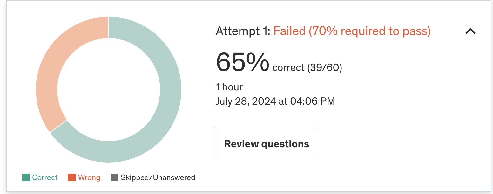

### ✏️ 4주차 오답노트
Practice Test 후 몰랐거나 헷갈린 내용, 새롭게 공부한 내용 등을 정리합니다.

#### 결과
오늘도 공부 못하고 봤어요 ㅠ 이제 진짜 공부 하고 봐야겠다.



#### 오답 정리

1. **The Outlier Pattern**   
[Building With Patterns: The Outlier Pattern](https://www.mongodb.com/blog/post/building-with-patterns-the-outlier-pattern)

- 특정 책을 구매한 사람들에 대한 정보를 저장할 때, book document 내부에 array로 저장 할 때 일반적으로는 동작하지만 책 판매가 급증할 경우 문제가 됨
```
{
    "_id": ObjectID("507f1f77bcf86cd799439011")
    "title": "A Genealogical Record of a Line of Alger",
    "author": "Ken W. Alger",
    …,
    "customers_purchased": ["user00", "user01", "user02"]

}
```
 
- 이런 경우 `customers_purchased` 배열 사이즈를 정해놓고 해당 사이즈를 넘는 경우 책 ID와 연결된 별도의 문서로 옮긴 후 확장되었다는 플래그(`has_extras`)를 추가해준다.

```
{
    "_id": ObjectID("507f191e810c19729de860ea"),
    "title": "Harry Potter, the Next Chapter",
    "author": "J.K. Rowling",
    …,
   "customers_purchased": ["user00", "user01", "user02", …, "user999"],
   "has_extras": "true"
}
```

2. **ObjectId 구성 요소**
- MongoDB ObjectId는 12byte BSON 타입의 고유한 id로 다음과 같은 요소를 기반으로 생성된다. [참고](https://www.mongodb.com/ko-kr/docs/manual/reference/method/ObjectId/)
  - Unix epoch 이후 초 단위로 측정된 ObjectId 생성을 나타내는 4바이트 타임스탬프.
  - 프로세스당 한 번씩 생성되는 임의의 5바이트 값, 머신과 프로세스마다 고유 
  - 임의의 값으로 초기화되는 3바이트 증분 카운터

3. **텍스트 검색을 위한 단계**
- [$text](https://www.mongodb.com/ko-kr/docs/manual/reference/operator/query/text/)
  ```
  {
    $text: {
        $search: <string>,
        $language: <string>,
        $caseSensitive: <boolean>,
        $diacriticSensitive: <boolean>
    }
  }
  ```
  - `$search`: MongoDB가 구문을 분석하고 텍스트 인덱스를 쿼리하는데 사용하는 용어 문자열
  - `$language`: 쿼리에 대한 중지 단어 목록과 형태소 분석기 및 토크나이저에 대한 규칙을 결정하는 언어 (선택 사항)
  - `$caseSensitive`: 대소문자 구분을 활성화/비활성화 할 수 있는 플래그 (선택 사항)
  - `$diacriticSensitive`: 버전 3 텍스트 인덱스에 대한 발음 구분 민감성을 활성화하거나 비활성화하는 플래그 (선택 사항)

- 제한 사항
  - 쿼리는 최대 1개의 $text 표현식을 지정할 수 있음
  - $text는 $nor 표현식에 나타날 수 없음
  - $text는 $elemMatch 쿼리 표현식, 프로젝션 표현식에 나타날 수 없음
  - $text에서 $or을 사용하려면 $or 배열의 모든 절을 인덱싱해야함
  - 쿼리에 $text 표현식이 포함된 경우 hint()를 사용해 쿼리에 사용할 인덱스를 지정할 수 없음

4. **Node.js driver 문서 삽입**
- 컬렉션에 JS객체 `newCustomer`를 삽입하는 방법
  ```
  db.collection('customers').insertOne(newCustomer)
  ```
  - !! `save()`는 Node.js driver에서 제공하는 함수가 아니다!!

- Node.js driver로 문서를 삽입하는 방법
  - `insertOne()`
  - `insertMany()`
  - `bulkWrite()`

- Node.js driver로 문서를 수정하는 방법
  - `updateOne()`
  - `updateMany()`
  - `replaceOne()`

- Node.js driver로 문서를 조회하는 방법
  - `find()`
  - `findOne()`

- Node.js driver로 문서를 삭제하는 방법
  - `deleteOne()`
  - `deleteMany()`

5. **가장 높은 salary 조회**

아래와 같은 구조의 컬렉션에서 Sales 부서 근무자들 중 최대 급여를 구하는 쿼리
```
{
   "_id": 1,
   "name": "John Doe",
   "department": "Sales",
   "salary": 5000
},
{
   "_id": 2,
   "name": "Jane Doe",
   "department": "Marketing",
   "salary": 6000
},
{
   "_id": 3,
   "name": "Jim Smith",
   "department": "Sales",
   "salary": 4500
}
```

- 내가 고른 답
  ```
   db.employees.find({department: "Sales"}).sort({salary: -1}).limit(1)
  ```

- 정답
  ```
  db.employees.aggregate([
  { $match: { department: "Sales" } },
  { $group: { _id: null, max_salary: { $max: "$salary" } } }
  ])
  ```

- 틀린 이유
  - 내가 고른 답은 `Sales` 부서 근무자들을 모두 찾은 후 `salary` 기준 내림차순 정렬 후 1개의 문서만 가져오는 쿼리이다.
  - 이 쿼리는 최대 급여를 가진 근무자 문서를 가져오지만 최대 급여만 조회하는 쿼리가 아니라 탈락
  - 정답 쿼리에서는 `Sales` 부서 근무자 문서를 필터링해 모든 문서(`_id: null`)를 그룹화하고 $max 연산자로 최대 급여를 계산한다.

6. **MongoDB objectId**
- MongoDB ObjectId에 대한 올바른 사실 찾기
- 내가 고른 답
  - ObjectId values are guaranteed to be monotonically increasing across all documents in a collection.

- 정답
  - The timestamp in ObjectId can be used to identify the exact creation time of the document.

- 틀린 이유 
  - ObjectId의 구성 요소 중 timestamp는 단조롭게 증가하지만, machine id, process id, process counter 에 의해 전체 값이 증가하는 방향은 아닐 수 있다.
  - timestamp는 Unix epoch 이후 초 단위로 측정된 ObjectId 생성을 나타내는 4바이트 타임스탬프로 문서의 정확한 생성 시간을 식별할 수 있다.

7. **Capped Collection 에서 최소 1일의 로그를 보장하는 법**
- [Capped Collection](https://www.mongodb.com/docs/manual/core/capped-collections/)
  - 삽입 순서에 따라 문서를 삽입하고 검색하는 고정 크기의 컬렉션
  - 컬렉션이 할당된 사이즈를 채우면 가장 오래된 문서를 덮어써 최신 문서를 위한 공간을 만든다.
  - log 데이터 저장에 많이 쓰인다.

```
db.createCollection( "log", { capped: true, size: 100000 } )
```

- 제한 사항
  - Capped Collection 은 샤딩할 수 없다.
  - 서버리스 인스턴스에서는 Capped Collection을 생성할 수 없다.
  - Stable API V1에서는 Capped Collection을 지원하지 않는다.
  - transaction에서 Capped Collection에 문서를 쓸 수 없다.
  - $out aggregation stage에서 Capped Collection에 결과를 쓸 수 없다.
  - Capped Collection을 읽을 때 read concern 중 `snapshot`을 사용할 수 없다.

- 참고
  - 일반적으로 **TTL(Time To Live) index가 Capped Collection보다 성능이 더 좋다**.
  - Capped Collection은 삽입을 직렬화함으로 일반적인 Collection보다 동시 삽입 성능이 더 안좋다.
  - TTL으로 해결할 수 있는 상황이면 TTL을 사용하는게 더 좋다.

- 문제 상황
  - 이미 10GB 제한의 Capped Collection에 log data를 저장하고 있음 여기서 더 많은 로그 데이터가 생성되는 새로운 기능을 추가하려 할 때 최소 1일의 로그를 저장할 수 있도록 보장하는 전략
    - Capped Collection 내부에 TTL index를 사용할 수 없기 때문에 정답은 **최소 1일의 로그를 저장할 수 있는 사이즈의 더 큰 Collection으로 migration하는 것이다**.
    - 기존에 존재하는 documents 를 모두 새 Capped Collection에 복사한다.
    - 마이그레이션 후에도 FIFO구조를 유지함으로 최신 데이터들이 남는다.

8. **쿼리에 대한 올바른 설명**
- 아래 쿼리에 대한 올바른 설명
```
db.companies.insertMany([
    {"name": "Facebook"}, 
    {"name": "Twitter"}
])
```

내가 고른 답 이외에 1개 더 정답이다.
- The _id field is not specified in any of these documents.

해석을 잘못해서 `_id` 필드가 삽입하고 구체적으로 지정되지 않는다라고 이해했는데
각 문서에 `_id`필드가 구체적으로 지정되어 있지 않다라는 의미여서 맞다.

9. **index 핸들링**

아래 구조의 문서가 있을 때
```
{
  _id: 5,
  last_name: 'Maurer',
  first_name: 'Alfred',
  year_born: 1868,
  year_died: 1932,
  nationality: 'USA'
}
```

`last_name`, `nationality` 필드에 각각 index를 생성했다.
```
db.artists.createIndex( { "last_name": 1, "nationality": 1 } )
```

아래 쿼리를 MongoDB가 어떻게 처리할까?
```
db.artists.find( { "last_name": /^O./ } )
```

- 정규식 쿼리라서 따로 지정해줘야 탈줄 알았서 COLLSCAN을 골랐는데 이 경우에도 `last_name`은 생성한 compound index의 접두사임으로 `last_name` 인덱스를 동일하게 타게 된다. 

10. **배열 필드 정렬**
- The arrays are sorted based on their first element.
- 배열 원소 타입이 다를 경우 사전순 정렬

11. **View**

- [View](https://www.mongodb.com/ko-kr/docs/manual/core/views/)
  - 다른 컬렉션 또는 aggregation pipeline에 의해 정의되는 쿼리 가능한 읽기전용  객체
  - 쉽게 말해 컬렉션에서 특정 조건을 걸어 새로운 읽기 전용 컬렉션 (view)을 만들어낸다고 보면 됨

- [createView()](https://www.mongodb.com/ko-kr/docs/manual/reference/method/db.createView/)
  - 지정된 aggregation pipeline을 소스 컬렉션 또는 view에 적용한 결과로 view 생성
  - 소스 컬렉션과 동일한 데이터베이스에 생성 해야함
  ```
  db.createView(<view>, <source>, <pipeline>, <collation>)
  ```
  - view: 만들려는 view 이름
  - source: 뷰를 생성할 소스 collection 이름
  - pipeline: aggregation pipeline으로 구성된 배열
  - collation: view의 기본 데이터 정렬을 지정 (선택 사항) 
    ```
    collation: {
      locale: <string>,
      caseLevel: <boolean>,
      caseFirst: <string>,
      strength: <int>,
      numericOrdering: <boolean>,
      alternate: <string>,
      maxVariable: <string>,
      backwards: <boolean>
    }
    ```
  - 참고로 `createView()`는 다음 create 명령을 래핑한다.
    ```
    db.runCommand( { create: <view>, viewOn: <source>, pipeline: <pipeline>, collation: <collation> } )
    ```

12. **MongoDB Scaling**
- [MongoDB Scaling](https://www.mongodb.com/resources/basics/scaling)
  - DB Scaling이 필요한 상황
    - CPU, Memory 로드가 심해 데이터베이스 서버가 요청에 대한 적절한 응답이 불가능한 경우
    - 데이터베이스 저장소가 꽉 찬 경우
    - 네트워크 인터페이스가 과부화되어 트래픽을 감당하지 못하는 경우

  - Vertical Scaling
    - 수직 확장은 단일 서버 또는 클러스터의 처리 능력을 높이는 것
  - Horizontal Scaling
    - 수평 확장은 로드를 공유하기 위해 추가 노드를 가져오는 것
    - 대표적으로 Replication, Sharding 기술이 수평 확장 기술

  - **Replication**
    - 데이터베이스, 데이터베이스 노드의 복사본을 만드는 것
    - 클러스터의 각 노드에 데이터 복사본 존재
    - 한 노드가 죽어도 다른 노드가 요청을 받을 수 있기 때문에 클러스터는 계속해서 클라이언트 요청을 처리할 수 있다. 
    - 클라이언트 요청이 단일 노드가 아닌 클러스터 내 여러 노드에 분산될 수 있기에 수평 확장의 한 종류이며 읽기 성능이 높아진다.
    - 시스템 총 저장 용량이나 쓰기 성능을 향상시키진 않는다.

  - **Partitioning(Sharding)**
    - 클러스터의 여러 노드에 데이터를 분산시키는 것
    - 각 replica set은 데이터 배포를 결정하는 컬렉션 샤딩 키를 기반으로 데이터를 일부만 저장
    - 사실상 제한없이 클러스터 스토리지 용량을 확장할 수 있음
    - 각 노드는 자신이 담당하는 데이터에 대한 쓰기/읽기만 처리함으로 전반적인 쓰기/읽기 성능이 모두 향상됨
    

- 정답 
  - Scaling horizontally is generally cheaper than scaling vertically. 
  - When scaling horizontally our scaling cost increases linearly.

- 내가 고른 답 중 옳지 않은 내용
  - When scaling vertically our scaling cost increases linearly.
  - 근데 수직 확장도 CPU나 메모리 같은 성능을 올리면 선형적으로 가격이 증가하는게 아닌가?..

13. **Partial Indexes**
- [Partial Indexes](https://www.mongodb.com/docs/manual/core/index-partial/)
  - 지정된 필터 표현식에 일치하는 컬렉션의 문서만 인덱싱
  - 컬렉션에 있는 문서의 하위 집합을 인덱싱함으로써 인덱스 생성/관리 비용을 줄일 수 있다.

  ```
  db.restaurants.createIndex(
   { cuisine: 1, name: 1 },
   { partialFilterExpression: { rating: { $gt: 5 } } }
  )
  ```

14. **array element filtering**
```
{
  genres: [ 'Comedy', 'Drama', 'Family' ],
  ...
}
```
movies collection 문서 내 배열 필드에서 예를 들어 genres가 정확히 `'Crime'`인 문서를 모두 조회하려면, 아래 두 쿼리 모두 가능하다.
```
db.movies.find( { "genres": { "$in" : ["Crime"] } } )
db.movies.find( { "genres": "Crime" } )
```

내가 고른 답 중 아래 쿼리는 `$equal` 이란 존재하지 않는 연산자때문에 정답이 아니다. `$eq`가 존재하는 연산자이다.
또한 `$eq`연산자는 배열 비교가 가능하지 않아 정답이 아니다.
```
db.movies.find( { "genres": { "$equal" : ["Crime"] } } )
```

15. **Data Modeling**
- 블로그 플랫폼을 만들 때, 각 게시물에는 여러 태그와 댓글이 존재하며, 각 댓글에는 여러 유저의 좋아요가 있을 수 있음. 이 경우 가장 효율적인 데이터 모델링은?

- 내가 고른 답
  - Embed tags within the blog post document, and store comments and upvotes in separate collections.

- 정답 
  - Embed comments and tags within the blog post document, and store user upvotes within each comment document.

- 틀린 이유
  - 블로그 개시글에 태그는 임베딩하는게 맞다고 생각했고, 댓글이 많이 달릴 수 있고, 그에 따른 좋아요도 많아질 수 있기 때문에 별도 컬렉션으로 분리해야한다 생각했지만, 게시글 업데이트, 댓글, 좋아요 모두 단일 문서에만 영향을 미치니 전부 다 게시글에 임베딩하는게 정답이라고 한다.. 

16. **Data Modeling**
- 소셜 미디어 플랫폼을 만들 때, 사용자, 친구, 사용자가 작성한 게시글을 추적해야함. 가장 적합한 데이터 모델링은?

- 내가 고른 답
  - One collection for users, one collection for friends, and one collection for posts. Each post document would contain a reference to the user who made the post.

- 정답
  - One collection for users, one collection for friends, and one collection for posts. Each user document would contain an array of references to their friends and an array of references to the posts they have made.

- 틀린 이유
  - 내가 고른 답은 게시글 안에 사용자 정보를 참조함으로 특정 사용자와 게시글에 대한 정보를 검색하기 어려움
  - 사용자 문서 안에 친구에 대한 정보와 친구의 게시글 정보를 참조하는게 효율적

17. **write concern**
- write concern 을 지정할 수 있는 CRUD 연산은?
  - `db.collection.update()`
  - `db.collection.insertOne()`
  - `db.collection.updateMany()`
  - `db.collection.insert()`

insert 못보고 선택안해서 틀렸다 

- [write concern](https://docs.mongodb.com/manual/reference/write-concern/)
  - 독립 실행형 mongod, replica sets, shard clusters에 대한 쓰기 작업을 위해 MongoDB에서 요청한 승인 수준을 설명
  - 샤딩된 클러스터에서 mongos 인스턴스는 write concern을 샤드에 전달

  ```
  { w: <value>, j: <boolean>, wtimeout: <number> }
  ```
  - w: 쓰기 작업이 지정된 수의 mongod 인스턴스 또는 지정된 태그가 있는 mongod 인스턴스로 전파되었다는 확인을 요청하는 옵션
  - j: 쓰기 작업이 디스크 상 저널에 기록되었다는 확인을 요청하는 옵션
  - wtimeout: 쓰기 작업이 무기한 차단되는 것을 방지하기 위해 시간 제한을 지정하는 옵션