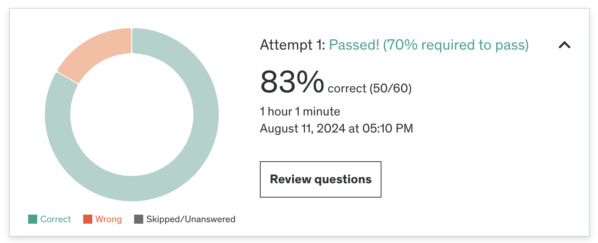

### ✏️ 6주차 오답노트
Practice Test 후 몰랐거나 헷갈린 내용, 새롭게 공부한 내용 등을 정리합니다.

#### 결과



#### 오답 정리

1. **deleteMany() 시 인덱스**

deleteMany() 메서드로 문서 삭제 시 관련된 인덱스는 어떻게 되는가?
- 해당 문서와 관련된 인덱스 항목이 즉시 삭제된다.
- 삭제된 문서는 더이상 인덱스에 포함되지 않으며 인덱스 기반 쿼리에 사용할 수 없음을 의미

2. **sparse index(희소 인덱스)**
- [sparse index](https://www.mongodb.com/ko-kr/docs/manual/core/index-sparse/)
  - 인덱스 필드에 null 값이 포함되어 있더라도 인덱스된 필드가 있는 문서에 대한 항목만 포함
  - 인덱스된 필드가 누락된 모든 문서를 건너뜀
  - non-sparse index는 반대로 컬렉션의 모든 문서를 포함하며 인덱싱된 필드를 포함하지 않는 문서는 null을 지정함
  - sparse 옵션을 true로 지정하면 sparse index가 생성됨
    ```
    db.addresses.createIndex( { "xmpp_id": 1 }, { sparse: true } )
    ```
  - `xmpp_id` 필드를 포함하지 않는 문서의 인덱스를 생성하지 않음

- 기본적으로 sparse index로 지정되는 index
  - 2d
  - 2dsphere (version 2)
  - text
  - wildcard

- sparse index 예제
  - 다음과 같은 scores 컬렉션을 생각해보자.
  ```
    { "_id" : ObjectId("523b6e32fb408eea0eec2647"), "userid" : "newbie" }
    { "_id" : ObjectId("523b6e61fb408eea0eec2648"), "userid" : "abby", "score" : 82 }
    { "_id" : ObjectId("523b6e6ffb408eea0eec2649"), "userid" : "nina", "score" : 90 }
  ```

  - score 필드에 sparse index를 지정하고
  ```
  db.scores.createIndex( { score: 1 } , { sparse: true } )
  ```
  - sparse index를 사용해 score 필드가 90 미만인 문서를 반환한다.
  ```
  db.scores.find( { score: { $lt: 90 } } )
  ```

  - `userid`가 `newbie`인 문서는 score 필드를 포함 하지 않아도 쿼리 기준을 충족하지 않기 때문에 sparse index를 사용해 결과를 반환할 수 있음
  
  ```
  db.scores.find().sort( { score: -1 } )
  ``` 
  - 다만 모든 컬렉션의 문서를 score 필드 기준으로 정렬하는 위와 같은 쿼리를 생각해볼 때 MongoDB는 **완전한 결과 집합을 반환하기 위해 sparse index를 선택하지 않는다.** 
    - `userid`: `newbie`인 문서에 `score` 필드가 없기 때문에 모든 문서에 대해 sparse index 적용 시 불완전한 결과 집합이 나옴

3. **index 생성 개수**
```
db.products.createIndex( { product_name: 1, product_category: -1 } )
```

- 다음 명령에서 인덱스가 몇개 생성 되는가?
  - 1개

- 인덱스 생성 개수가 아니라 주엊니 복합 인덱스 생성 시 `product_name`, `product_name product_category` 이렇게 2개 경우에 적용된다고 생각해서 2개 골라 틀림

4. **참조 관계에서 별도 컬렉션 사용시 이점**
- 유지 관리가 향상되고 관련 엔티티에 대한 업데이트 복잡성이 줄어든다.
  - 별도 컬렉션으로 관리 시 컬렉션을 독립적으로 관리하고 업데이트 할 수 있으므로 유지 관리의 이점이 있다.
  - 각 컬렉션에 고유한 업데이트와 데이터 변경 집합이 있을 수 있어 업데이트 복잡성도 줄어든다.

5. **MongoDB View**
- [View](https://www.mongodb.com/ko-kr/docs/manual/core/views/)
  -  aggregation pipeline에 의해 내용이 정의되는 읽기 전용 쿼리 가능 객체
  -  view 콘텐츠를 디스크에 보존하지 않는다. 
     - view 콘텐츠는 클라이언트가 view를 쿼리할 때 온디맨드 방식으로 계산됨
  - 사용 예시
    - 개인 식별 정보(민감한 정보, 특정 필드)를 제거한 View를 제공할 수 있다.
    - 특정 컬렉션들을 조인한 결과 View를 제공할 수 있다.

6. **MongoDB Database Naming Convention**
- MongoDB 명명 규칙에서는 일반적으로 camelCase를 추천한다고 한다.
- 이 밖에 네이밍 제한 사항들도 있다. [참고](https://www.mongodb.com/docs/manual/reference/limits/#naming-restrictions)
  - 예시
    - `salesData`, `SalesData` 이름을 가진 두개의 데이터베이스를 만들 수 없음 (대소문자 구분 X)
    - windows
      - 아래 문자가 포함된 이름을 가질 수 없음
        ```
        /\. "$*<>:|?
        ```
    - ubuntu/linux
      - 아래 문자가 포함된 이름을 가질 수 없음
        ```
        /\. "$
        ```
    - database 이름은 비워둘 수 없으며 64바이트 미만의 길이여야함


7. **Shard key - targeted queries**
```
{ "airline_id" : 1, "departure_airport" : 1 }
```
- 위 인덱스가 shard key로 지정된 경우 
- prefix인 `airline_id`을 포함하거나 
- `aireline_id`, `departure_airport` 두개 다 포함하는 쿼리가 
shard key를 포함하는 targeted query 가 될 수 있다.

8. **일대다 관계를 나타내는 가장 적합한 모델링 방식**
- array embedding
  - 엔티티 중 하나를 문서 배열로 다른 엔티티에 포함 시킨다.
  - 근데 이 방식은 1:소일때 문제가 없는데 문서 배열이 너무 많아지면 컬렉션 분리가 제일 나은거 아닌가..?

9. **Covered query**
- [Covered Query](https://www.mongodb.com/docs/manual/core/query-optimization/#covered-query)
  - 인덱스를 사용하여 완전히 만족할 수 있고 검사할 필요가 없는 쿼리
    - 쿼리의 모든 필드는 인덱스의 일부이며
    - 결과에 반환되는 모든 필드는 동일한 인덱스에 있고
    - 쿼리의 어떤 필드도 null 과 동일하지 않을 때  

```
db.inventory.createIndex( { type: 1, item: 1 } )
```
  - 다음과 같이 type, item에 인덱스가 적용되어있을 때
```
db.inventory.find(
   { type: "food", item:/^c/ },
   { item: 1, _id: 0 }
)
```
  - type과 item을 쿼리하고 item만 반환하는 쿼리를 실행하면 covered query로 동작하게 된다. 
  - 이 경우 명시적으로 `_id: 0` 을 지정하지 않으면 항상 포함하기 때문에 covered query가 적용되려면 `_id`필드를 가져오지 않도록 해야함