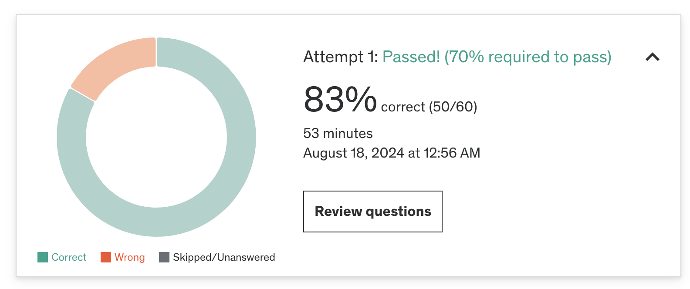

### ✏️ 7주차 오답노트
Practice Test 후 몰랐거나 헷갈린 내용, 새롭게 공부한 내용 등을 정리합니다.

#### 결과



#### 오답 정리

1. **Sharded collection에서 참조된 문서 deleteMany**
> sharded collection에서 다른 collection이 참조하는 문서를 삭제할 경우

- 에러 발생
  - 샤딩된 컬렉션에서 다른 문서에서 참조하고 있는 문서를 삭제 할 경우 오류 발생
  - MongoDB는 참조 문서에 대한 자동 업데이트나 삭제를 지원하지 않음
  - 삭제 전 참조하고 있는 문서가 업데이트 됐거나 제거됐는지 미리 확인 필요


2. **MongoDB Anti-Pattern**

[A Summary of Schema Design Anti-Patterns and How to Spot Them](https://www.mongodb.com/developer/products/mongodb/schema-design-anti-pattern-summary/)

- Anti-Patterns 
  - **Massive Arrays**
    - 자주 액세스 하는 데이터를 함께 저장하는 것은 효율적임
    - 하지만 때때로 과격하게 하나의 문서에 많은 정보를 담는 것은 문제가 됨
    - 배열에 방대해질 경우 16mb 사이즈 제한에 빨리 도달
    - 배열에서 인덱스를 읽고 작성하는 성능이 점차 저하됨
  - **Massive number of collections**
    - 컬렉션이 많아질수록 따라오는 스토리지 비용
    - 모든 컬렉션에 기본적으로 붙는 `_id` 필드 인덱스 + 사용자 지정 인덱스가 컬렉션마다 생기고, 사용하지 않는 인덱스가 차지하는 리소스가 큼
    - 일반적으로 10000개 이하의 컬렉션을 권장
  - **Unnecessary indexes**
    - 인덱스는 공간을 차지
    - 인덱스는 스토리지 엔진 성능에 영향을 미칠 수 있음
      - MongoDB의 [WiredTiger Storage Engine](https://www.mongodb.com/docs/manual/core/wiredtiger/)은 각 컬렉션과 인덱스에 대한 파일을 저장
      - wiredtiger 엔진은 시작시 모든 파일을 열기 때문에 컬렉션과 인덱스가 너무 많으면 성능이 저하됨
    - 인덱스는 쓰기 성능에 영향을 미침
      - 문서가 생성/수정/삭제될 때 마다 해당 문서와 연관된 모든 인덱스도 업데이트해야함
    - 일반적으로 인덱스 컬렉션은 50개 이하로 제한하는 것을 권장
    - 불필요한 인덱스를 검증하는 방법
      - 사용하지 않는 인덱스인지 -> compass나 atlas에서 usage 확인
      - 다른 인덱스 때문에 중복되는 인덱스인지 
  - **Bloated documents**
    - MongoDB에서 가장 빠르게 쿼리하는 방법은 자주 액세스 되는 문서+인덱스여서 storage 엔진의 디스크가 아닌 메모리에서 쿼리되는 것이다.
    - 다만 메모리는 사이즈가 작기 때문에 문서를 RAM 할당량에 맞을만큼 작게 유지하는 것이 좋다.
      - 보통 할당량은 256MB, RAM의 50% 중 더 큰 값을 사용
    - 문서 사이즈가 과다하게 커졌는지 검증하기 위해서는 "자주 함께 액세스"가 아니라 "서로 관련된 문서"를 저장하는지 확인하자
      - 서로 관련된 문서는 [subset pattern](https://www.mongodb.com/blog/post/building-with-patterns-the-subset-pattern)을 활용해 문서를 작게 나누는 것이 좋다.
  - **Separating Data That is Accessed Together**
    - MongoDB에서는 관련된 문서를 서로 다른 컬렉션에 나누고 참조할 수 있음
    - 다만 이렇게 나눠진 문서를 합쳐서 가져오려면 `$lookup`과 같은 join 연산을 해야함
    - `$lookup` 연산은 리소스 집약적이고 느리기때문에 빈번하게 사용하는 것은 추천하지 않음
    - 자주 함께 액세스 되는 데이터는 함께 저장하는 것이 효율적 (document, array embedding 사용)
    - 다만 이런 이유로 과도하게 한 문서로 포함시킬 경우 다른 안티패턴을 유발 할 수 있기에 적절히 사용해야함
  - **Case-Insensitive Queries Without Case-Insensitive Indexes**
    - MongoDB는 대소문자를 구분하지 않는 쿼리를 실행하는 3가지 방법을 제공
      1. `$regex` + `i` option
         - 다만 `$regex` 를 사용한 대소문자를 구분하지 않는 쿼리는 대소문자를 구분하지 않는 인덱스를 효율적으로 사용할 수 없어 데이터 양에 따라 느려질 수 있음
      2. Case-Insensitive Indexes 생성
         - 대소문자를 구분하지 않는 인덱스를 생성하고 동일한 인덱스를 정렬에 사용
         - 인덱스는 선택적으로 [collation](https://www.mongodb.com/docs/manual/reference/collation/)을 가질 수 있어 문자열 비교에 사용할 언어별 규칙을 지정할 수 있음
         - 대소문자 구분 없는 인덱스와 동일한 정렬로 실행되는 쿼리는 대소문자 구분없는 결과를 반환하고 이 쿼리는 매우 빠르게 실행됨
       3. 컬렉션 생성 시 collation strength를 1 또는 2로 설정
          - 쿼리를 생성하거나 인덱스를 생성할 때 별도로 지정하지 않는 경우 default collation strength를 사용
          - 이를 1 또는 2로 지정할 경우 대소문자 구분 없는 쿼리 결과를 반환
3. **Read Concern levels**
- [Read Concern](https://www.mongodb.com/docs/manual/reference/read-concern/)
  - replica set이나 샤딩된 클러스터에서 데이터 일관성, 격리 속성을 제어할 수 있는 옵션

    Read Concern levels

    |level|description |
    |------|------------------------------|
    |"local"| 데이터가 대부분의 복제본 세트에 기록되었다는 보장없이 인스턴스의 데이터를 반환(롤백될 수 있음), 일관된 세션 및 트랜잭션 유무와 관계없이 사용할 수 있음  |
    |"available"|데이터가 대부분의 복제본 세트에 기록되었다는 보장없이 인스턴스의 데이터를 반환(롤백될 수 있음), 일관된 세션 및 트랜잭션에 사용할 수 없음|
    |"majority" | 대다수 복제본 세트 구성원이 확인한 데이터를 반환, 일관된 세션 및 트랜잭션 유무와 관계없이 사용할 수 있음  |
    |"linearizable" | 읽기작업이 시작되기 전에 완료된 모든 성공적인 쓰기를 반영한 데이터만 반환, 일관된 세션 및 트랜잭션에 사용할 수 없음 |
    |"snapshot" | 최근 특정 단일 시점의 샤드 전체에 나타나는 대다수 커밋 데이터를 반환, read concern이 "snapshot"이면 write concern이 "majority" 인 경우에 일관된 세션, 트랜잭션 보장을 제공 |

4. **Many to Many modeling**
> 다대다 관계일 경우 두 엔티티의 관계를 저장하는 별도 컬렉션 생성

5. **index가 사용되는 쿼리**
```
   "airplane":1,
   "src_airport":1,
   "dst_airport":1,
   "stops":1
```
다음과 같은 인덱스가 있을 때 인덱스를 사용할 수 있는 쿼리 

```
db.routes.find( { airplane: 'CNC', src_airport: { $gt: 'C' } } ).sort( { src_airport: 1 } ) -> 사용

db.routes.find( { airplane: 'CNC' } ).sort( { dst_airport: 1 } ) -> 사용 x, src_airport 건너뜀

db.routes.find( { airplane: 'CNC' } ).sort( { src_airport: 1, dst_airport: 1 } ) -> 사용

db.routes.find( { dst_airport: 'SFO' } ).sort( { airplane: 1 } ) -> 사용 x, src_airport 건너뜀
```

문제에서 정렬에 사용되는 인덱스라 해서 sort 쪽만 봐서 틀렸다

6. replica set에서 `deleteOne`과 `deleteMany`의 차이
- `deleteOne` 시 primary 노드와 복제 노드 모두에서 삭제됨
- `deleteMany` 시 primary 노드에서 제거되고 이후 복제 주기에 복제 노드에서도 삭제됨

7. 올바른 JSON 형식
```
{_id: 1, name: "Riviera Caterer", cuisine: "American"}
```
`_id` 필드에 따옴표로 묶여있지 않아 잘못된 형식이다!
따옴표 있는지 못봤다..

